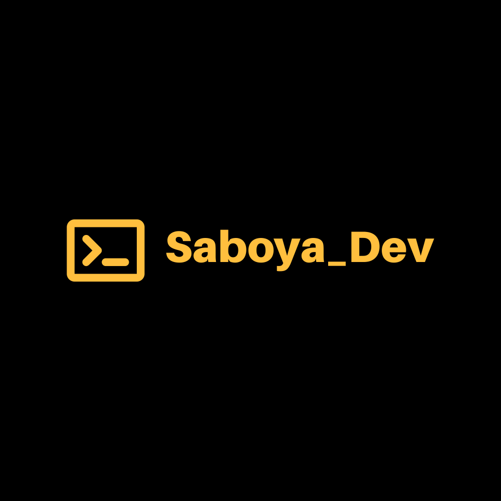

   &nbsp;&nbsp;&nbsp;&nbsp;&nbsp;&nbsp;&nbsp;&nbsp;&nbsp;&nbsp;&nbsp;&nbsp;&nbsp;&nbsp;&nbsp;&nbsp;&nbsp;&nbsp;&nbsp;&nbsp;&nbsp;&nbsp;&nbsp;&nbsp; 
<!--    -->
     
## Hi I'm Jose L Saboya --> (Saboya_Dev) Front-end Developer 

#### Github Stats

Front-end Web Developer with experience in React and currently working as an EMT (Emergency Medical Tech) and freelance Web Development. Graduated from Rutgers University 6 month Coding Bootcamp, where I gained my certification in Web Development and honed my skills in JavaScript, React.js, SQL and No-SQL Databases, and Back-End technologies such as Node.js.

:mailbox: Reach Out To Me!

   

- 💻 Front-end Web Developer
- 📫 How to reach me: SaboyaDev@gmail.com.
- ⚡ Fun facts: I'm a musician, and I'm a Big Nikola Tesla fan.

#### Top Technologies

   

#### Bizness
- :paperclip: [My Resume/CV](https://saboya-dev-github.s3.amazonaws.com/TechResumes/webDeveloperResume2022.pdf)
- :email: SaboyaDev@gmail.com

#### Profile Visits

